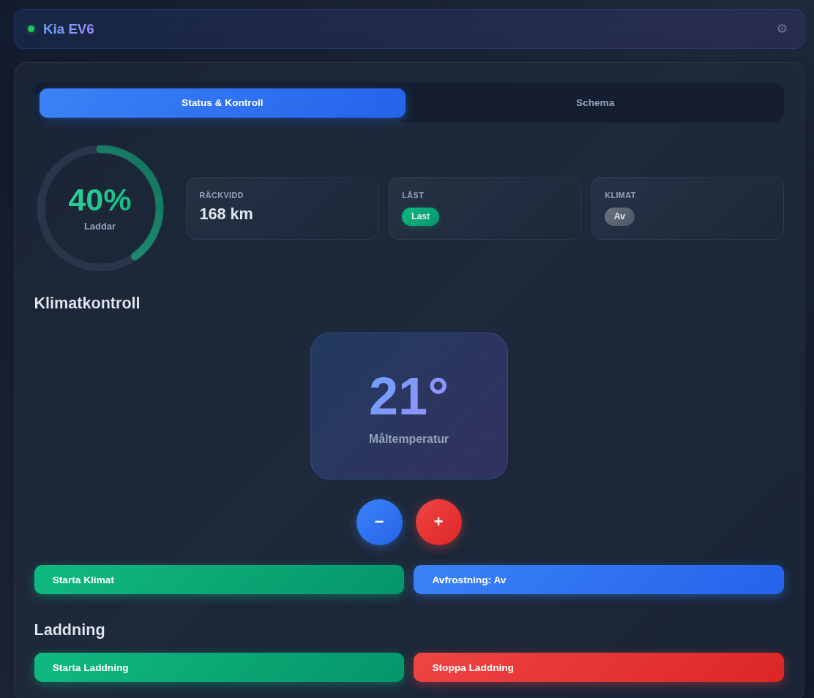
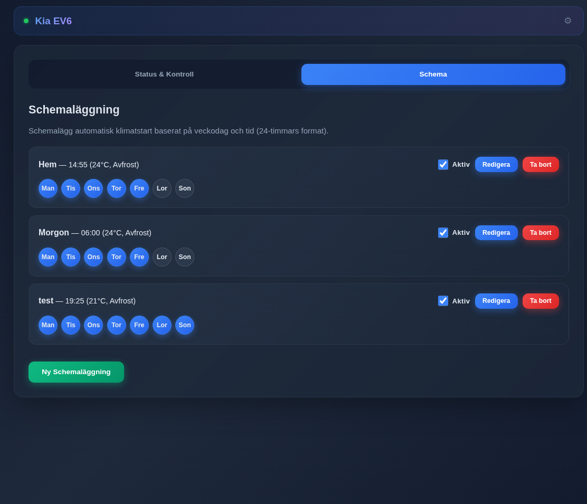

# Kia EV6 Climate Control

En webbapplikation för att styra klimatanläggningen i din Kia EV6 via Kia UVO API. Schemalägg uppvärmning, starta/stoppa klimat på distans och övervaka fordonsstatus.


---

## Screenshots

### Huvudsida


### Schemahantering


---

## Funktioner

### Klimatkontroll
- Starta/stoppa klimatanläggning på distans
- Ställ in måltemperatur (16-30°C)
- Avfrostningsfunktion
- Verifierad klimatstart - bekräftar att klimatet faktiskt startade och försöker igen vid behov

### Schemaläggning
- Skapa schemalagda klimatstarter
- Välj specifika veckodagar
- Aktivera/inaktivera scheman med en knapptryckning
- Redigera och ta bort befintliga scheman
- Verifierad start med automatiskt retry

### Fordonsstatus
- Batterinivå med cirkulär gauge (klickbar för att uppdatera)
- Räckvidd
- Batteriring ändrar färg vid laddning (grönt pulsljus)
- Fordonsvarningar visas bara om något är öppet eller olåst

### Token-hantering
- Inbyggd token-hantering via admin-sidan (kugghjulsikon)
- Visuell steg-för-steg guide för att hämta tokens
- Automatisk token-utbyte direkt i webbgränssnittet
- Automatisk token-refresh vid utgång (5 min marginal)
- Real-time anslutningsstatus

### Användargränssnitt
- Kompakt header med anslutningsstatus
- Mörkt tema med gradient-design
- Responsiv design
- Animerad batterimätare med laddningsindikering
- Auto-uppdatering av status vid sidladdning

---

## Snabbstart

### Utveckling (lokalt)

1. **Klona repositoryt**
   ```bash
   git clone https://github.com/alun-hub/kia-climate-control
   cd kia-climate-control
   ```

2. **Skapa virtuell miljö**
   ```bash
   python -m venv venv
   source venv/bin/activate
   ```

3. **Installera dependencies**
   ```bash
   pip install -r requirements.txt
   ```

4. **Starta servern**
   ```bash
   python kia_backend.py
   ```

5. **Konfigurera tokens via webbgränssnittet**
   1. Öppna `http://localhost:5000`
   2. Klicka på kugghjulsikonen uppe till höger för att nå admin-sidan
   3. Följ den visuella guiden för att hämta dina tokens
   4. Spara direkt i webbgränssnittet - klart!

---

## Produktion (Podman Container)

Flask-appen servar både frontend och API - ingen separat webbserver behövs.

Se [DEPLOYMENT.md](DEPLOYMENT.md) för detaljerad deploymentguide.
För Cloudflare Tunnel deployment, se [CLOUDFLARE-TUNNEL.md](CLOUDFLARE-TUNNEL.md).

### Snabbversion:

```bash
# Bygg container (Raspberry Pi)
podman build -f Dockerfile.pi -t kia-climate-control:latest .

# Skapa data-mapp
mkdir -p data

# Kör container
podman run -d \
  --name kia-climate \
  -p 5000:5000 \
  -v ./data:/app/data \
  -v ./.env:/app/.env \
  -v /etc/localtime:/etc/localtime:ro \
  --restart unless-stopped \
  localhost/kia-climate-control:latest
```

---

## Förutsättningar

### Kia UVO Credentials
Du behöver:
- **E-postadress** för Kia Connect-appen
- **Refresh Token** från Kia UVO API

#### Hur får jag refresh token?
1. Öppna admin-sidan (kugghjulsikonen) i webbappen
2. Följ den inbyggda guiden för att hämta tokens
3. Alternativt: använd verktyg som [mitmproxy](https://mitmproxy.org/) eller `get_kia_token.py`

---

## Teknisk Stack

### Backend
- **Python 3.11** (Alpine)
- **Flask** - Webbserver
- **hyundai-kia-connect-api** - Kia UVO API integration
- **python-dotenv** - Environment variables

### Frontend
- **Vanilla JavaScript** - Inga frameworks
- **Modern CSS** - Gradient design, mörkt tema
- **SVG** - Cirkulär batterimätare

### Containerization
- **Podman** - Container runtime
- **Alpine Linux** - Minimal image-storlek

---

## Projektstruktur

```
kia-climate-control/
├── kia_backend.py          # Flask backend + Kia API integration
├── public/
│   ├── index.html          # Huvudsida (status, klimatkontroll)
│   └── admin.html          # Admin-sida (tokens, schemaläggning)
├── data/                   # Persistent storage (volume)
│   └── schedules.json      # Sparade scheman
├── Dockerfile.pi           # Container definition (Alpine, ARM64)
├── docker-compose.yml      # Compose configuration
├── requirements.txt        # Python dependencies
├── .env                    # Environment variables (ej i git)
├── front.png               # Screenshot huvudsida
├── sched.png               # Screenshot schemasida
├── DEPLOYMENT.md           # Deployment guide
├── CLOUDFLARE-TUNNEL.md    # Cloudflare Tunnel setup
├── CLOUDFLARE-SECURITY.md  # Säkerhetskonfiguration
├── RASPBERRY-PI-SETUP.md   # Pi Zero 2W installation
├── RASPBERRY-PI-PODMAN.md  # Pi + Podman guide
├── PI3B-QUICKSTART.md      # Pi 3B snabbstart
└── README.md               # Denna fil
```

---

## Säkerhet

### För Cloudflare Tunnel (Rekommenderat):

Se [CLOUDFLARE-SECURITY.md](CLOUDFLARE-SECURITY.md) för fullständig guide om:
- Automatisk HTTPS och SSL-certifikat
- Cloudflare Access - Autentisering (gratis upp till 50 användare)
- Rate limiting och DDoS-skydd
- Ingen öppen port på din router

### Allmänna rekommendationer:

1. **Secrets Management**
   - Rotera Kia UVO tokens regelbundet
   - Använd admin-sidan för att uppdatera credentials

2. **Backups**
   - Säkerhetskopiera `data/schedules.json`
   - Spara credentials säkert

3. **Monitoring**
   - Granska loggar regelbundet: `podman logs kia-climate`

---

## Acknowledgments

- [hyundai-kia-connect-api](https://github.com/Hyundai-Kia-Connect/hyundai_kia_connect_api) - Kia UVO API-integrationen

---

## Disclaimer

Detta projekt är inte officiellt godkänt av Kia. Använd på egen risk. Kia kan när som helst ändra sitt API vilket kan göra denna applikation icke-funktionell.

---

## Support

1. Kontrollera [DEPLOYMENT.md](DEPLOYMENT.md)
2. Kontrollera loggar: `podman logs kia-climate`
3. Öppna en issue på GitHub
